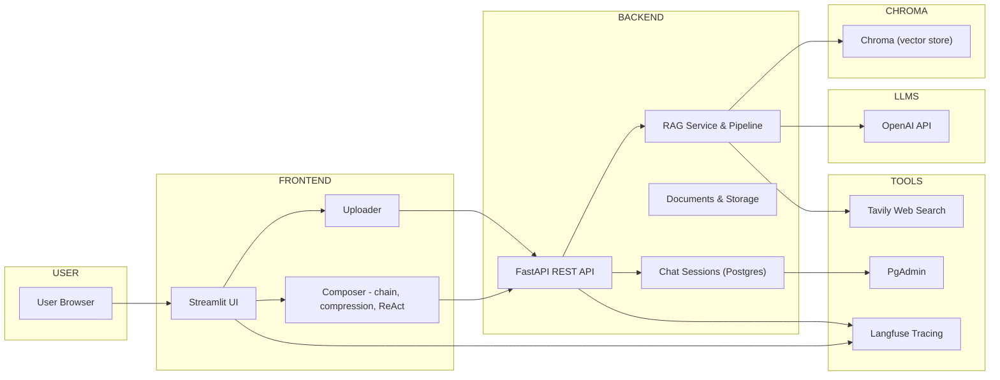

# DocGPT (RAG PDF QA)

DocGPT is a small product-style Retrieval-Augmented Generation (RAG) application that lets you upload PDFs and ask questions with citations, optional web search (ReAct), chunk compression, and quality checks (self-reflection and evaluation). It includes a Streamlit-based frontend and a FastAPI backend with Postgres for persistence and Chroma for vector search.

---

## Features

- Upload PDFs and build a semantic index (local Chroma vector store).
- Ask questions with sources/citations (RAG): `stuff`, `map_reduce`, `refine` chain strategies.
- Optional chunk compression (reduces token usage and focuses context).
- ReAct Agent mode: combines RAG search with external web search tools when the PDF doesn't contain the answer.
- Conversational memory (chat sessions saved per authenticated user).
- Anonymous mode: complete, usable session stored only in the browser session (not persisted to the backend or DB).
- Built-in evaluation and analytic endpoints for saving LLM metrics and evaluation rows.
- PgAdmin included for DB browsing when running locally with Docker.

---

## High-level architecture

- Frontend: Streamlit app at `frontend/app.py`. Provides the UI for uploading PDFs, composing queries, configuring options (chain type, compression, self-reflection, ReAct), and viewing chat history and sources.
- Backend: FastAPI app at `backend/main.py` which exposes endpoints to upload documents, create/load chat sessions, and post chat messages. The backend persists users, documents, sessions, and messages to Postgres via SQLAlchemy.
- Vector DB: Chroma (file-backed SQLite store) used to persist embeddings; persisted under the Docker volume `backend_chroma` (mapped to `/app/chroma_db` in the backend container).
- Retrieval / LLM stack: LangChain wrappers using `langchain-openai` and `langchain-chroma`, with `ChatOpenAI` for LLMs (OpenAI API key required). The RAG pipeline is implemented in `backend/rag_pipeline.py` and the query tools for agents in `backend/rag_tools.py`.
- Authentication: Basic JWT flows + Google OAuth support found under `backend/google_oauth.py` and `backend/auth.py`.

---

## Tech stack


DocGPT is a production-oriented Retrieval-Augmented Generation (RAG) system focused on answering questions over PDF documents with citations, quality checks, optional web search, and developer-focused observability. It combines a Streamlit frontend UI with a FastAPI backend, persistent Postgres storage for authenticated users, and Chroma as the vector store for semantic retrieval. The system is designed for both interactive demos (Streamlit) and programmatic use via API.

Key capabilities:
- PDF ingestion (PyMuPDF) and chunking (RecursiveCharacterTextSplitter)
- Embeddings via `OpenAIEmbeddings` and vector storage in Chroma
- Conversational retrieval with LangChain `ConversationalRetrievalChain` supporting chain strategies: `stuff`, `map_reduce`, `refine`
- Chunk compression via `ContextualCompressionRetriever` to reduce token usage
- ReAct agent mode: combines RAG search with external web tools (Tavily) and agent orchestration (LangChain agents)
- Anonymous, local-only sessions (no persistence) and authenticated sessions (persisted in Postgres)
- Observability/tracing via Langfuse integration
- Evaluation & analytics endpoints for saving LLM metrics and human eval rows

---

## Expanded Feature Summary

- Document ingestion: upload PDFs, split into chunks, and index into local Chroma (persisted in Docker volume). Metadata (filename, source) is stored with chunks.
- Retrieval strategies: `stuff` (concat), `map_reduce` (map per chunk + reduce), `refine` (iterative refinement). These are exposed to the user as `Chain type` options.
- Compression: optional LLM-based chunk compression reduces the size of retrieved context.
- ReAct + Tools: the ReAct agent can run RAG searches and use Tavily web search as a tool to augment answers when the PDF lacks the information.
- Sessions: authenticated users get persistent chat sessions (stored in Postgres, viewable via `Your chats`); anonymous users get a full-featured local session that resets on refresh.
- Tracing & observability: Langfuse integration captures prompts, token usage, latency, and retrieval decisions for debugging and analysis.
- Analytics: endpoints to capture evaluation rows and LLM metric reports; built-in CSV export/ dashboards in the frontend.

---

## High-level architecture & system diagram

The system has three primary runtime components: the Streamlit frontend (user UI), the FastAPI backend (persistence, orchestration), and the vector/LLM infrastructure (Chroma + OpenAI). Additional integrations: Tavily for web search, Langfuse for tracing, PgAdmin for DB inspection.

Mermaid diagram (high-level):

```mermaid
flowchart LR
	subgraph User
		U[User Browser]
	end

	subgraph Frontend [Streamlit Frontend]
		FUI[UI Components]
		FUpload[Uploader]
		FComposer[Composer (chain type, compression, ReAct)]
	end

	subgraph Backend [FastAPI Backend]
		API[REST API]
		Sessions[Chat Sessions (Postgres)]
		Docs[Documents & Storage]
		RAGSrv[RAG Service & Pipeline]
	end

	subgraph VectorStore [Chroma (persisted volume)]
		ChromaDB[(chroma.sqlite3)]
	end

	subgraph LLMs[LLM Providers]
		OpenAI[OpenAI API]
	end

	subgraph Tools
		Tavily[Tavily Web Search]
		Langfuse[Langfuse Tracing]
		PgAdmin[PgAdmin]
	end

	U --> FUI
	FUI --> FUpload
	FUI --> FComposer
	FUpload --> API
	FComposer --> API
	API --> RAGSrv
	RAGSrv --> ChromaDB
	RAGSrv --> OpenAI
	RAGSrv --> Tavily
	API --> Sessions
	Sessions --> PgAdmin
	API --> Langfuse
	FUI --> Langfuse

	classDef infra fill:#f9f,stroke:#333,stroke-width:1px;
	class VectorStore,LTM,OpenAI infra;
```

The flow:
- Users interact with the Streamlit frontend to upload PDFs, configure options, and ask questions.
- The frontend either calls the backend (authenticated/persisted flows) or uses a local pipeline (anonymous/local-only flow).
- The backend's RAG service loads/creates pipelines, indexes documents into Chroma, retrieves relevant chunks, and invokes LLMs to generate answers.
- ReAct agent flows call `RAGSearch` (pipeline) and external web search (Tavily) as tools.
- Langfuse traces are emitted from frontend/backend/RAG layers to capture prompts, token usage, and latency.

---

## Full tech stack & keywords (for showcase)

- Languages & Runtimes: Python 3.11, Bash
- Web / UI: Streamlit, HTML/CSS (embedded), streamlit-components
- API: FastAPI, Uvicorn
- Database: PostgreSQL, SQLAlchemy, Alembic (if used), PgAdmin
- Vector DB / Retrieval: Chroma (langchain-chroma, chromadb), Max Marginal Relevance (MMR)
- LLM integration: OpenAI (ChatGPT / gpt-3.5 / gpt-4 via openai + langchain-openai)
- Chains & Agents: LangChain (chains, retrievers, conversational retrieval), langchain-community
- Tools / Plugins: Tavily web search integration, custom RAG tools
- Compression & Splitters: RecursiveCharacterTextSplitter, ContextualCompressionRetriever, LLMChainExtractor
- Observability: Langfuse (tracing), logging
- Embeddings & Tokenization: OpenAIEmbeddings, tiktoken
- File handling: PyMuPDF, file upload streams, local storage
- Auth: JWT (python-jose), Google OAuth integration
- Utilities: python-dotenv, requests, tenacity (retry), passlib, python-multipart
- Packaging & Deployment: Docker, Docker Compose, volumes, environment variables
- Metrics & Analytics: CSV export, analytics dashboards (pandas, matplotlib)

---

## Environment variables (comprehensive)

- REQUIRED / CORE
	- `OPENAI_API_KEY` — OpenAI API key
	- `POSTGRES_USER`, `POSTGRES_PASSWORD`, `POSTGRES_DB`
	- `DATABASE_URL` (optional override)
	- `JWT_SECRET` — JWT signing secret

- OPTIONAL / INTEGRATIONS
	- `GOOGLE_CLIENT_ID`, `GOOGLE_CLIENT_SECRET`, `GOOGLE_REDIRECT_URI` — Google OAuth
	- `TAVILY_API_KEY` — Tavily web search
	- `LANGFUSE_HOST`, `LANGFUSE_PUBLIC_KEY`, `LANGFUSE_SECRET_KEY` — Langfuse tracing
	- `FRONTEND_BASE`, `API_BASE_INTERNAL`, `API_BASE_PUBLIC`

---

## How to run (Docker Compose — recommended)

1. Create an `.env` file in the repo root with required variables (example below).
2. Start the stack:

```bash
# from repo root
docker compose -f infra/docker-compose.yml up --build
```

Access:
- Streamlit UI: `http://localhost:8501`
- Backend API docs (if enabled): `http://localhost:8000/docs`
- PgAdmin: `http://localhost:5050` (default `admin@example.com` / `admin`)

Notes:
- The backend persists chat sessions and documents only for authenticated users. Anonymous users use a local pipeline and session state in Streamlit (cleared on refresh).
- Chroma database files are persisted in the Docker volume `backend_chroma`. If the Chroma sqlite file becomes corrupted (missing tables), the backend contains logic to remove the file and recreate a fresh Chroma DB automatically.

Example `.env` (skeleton):

```ini
POSTGRES_USER=postgres
POSTGRES_PASSWORD=postgres
POSTGRES_DB=ragqa
OPENAI_API_KEY=sk-xxxx
JWT_SECRET=change-me
# Optional
GOOGLE_CLIENT_ID=...
GOOGLE_CLIENT_SECRET=...
TAVILY_API_KEY=...
LANGFUSE_HOST=...
LANGFUSE_PUBLIC_KEY=...
LANGFUSE_SECRET_KEY=...
```

---

## Developer & maintenance notes

- `backend/rag_pipeline.py` contains the logic for initializing the Chroma client, retriever, and LangChain `ConversationalRetrievalChain`. It includes recovery paths for broken sqlite schema.
- `backend/rag_tools.py` exposes a `RAGSearch` tool for LangChain agents — it handles exceptions gracefully so agents don't crash on retrieval failures.
- `frontend/app.py` contains the Streamlit UI, composer controls (chain type, compression, ReAct), anonymous vs authenticated flows, and the introductory landing card displayed on new sessions.
- Tests: add integration tests that upload a small PDF, index, and query various chain strategies; consider using a local/mock OpenAI for CI.

---

If you'd like, I can also:
- Add an `.env.example` file to the repo.
- Add a `dev.sh` script to simplify `docker compose up --build` and environment checks.
- Generate a simple sequence diagram (Mermaid) for agent flows (RAG -> Tavily -> LLM).

Would you like me to add the `.env.example` and `dev.sh` now?

